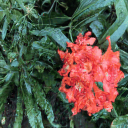

# Denoising Diffusion Models for Plug-and-Play Image Restoration

## Installation Commands
```bash
pip install -r requirements.txt
# Download pretrained models 
# (in case google drive doesnot permit, 
# download manually from link shown after running following command)

chmod +x download.sh
./download.sh


# running the main deblurring session
chmod +x runner.sh
./runner.sh <path to directory of images> <choose between Gaussian or motion>
```


|Case | Ref Dataset | Diff-PIR Predictions |
|---------|------------------|------------------|
|1| <br>Synthetic Motion Blurred | <br>Prediction |
|2| <br>Synthetic Resolution (Gaussian) Blurred | <br>Prediction |


# Reference
https://github.com/yuanzhi-zhu/DiffPIR
